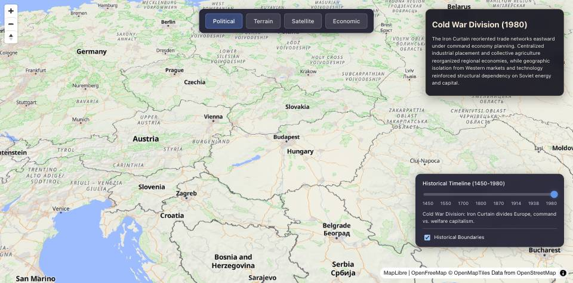

# geomat

An interactive historical-geography explorer. A [MapLibre](https://maplibre.org)
map with a timeline from late feudalism to the Cold War: switch the base layer,
scrub through periods, toggle historical boundaries, and read how geography and
world-systems position shaped the political economy of each era.



## What it does

- **Timeline of periods** — Late Feudalism (1450), Early Modern (1550),
  Mercantile Era (1700), Early Industrial Revolution (1800), High Industrial
  Era (1870), High Imperialism (1914), Interwar Period (1938), Cold War
  Division (1980).
- **Base layers** — Political, Terrain, Satellite, Economic.
- **Historical boundaries** — per-period GeoJSON overlays that redraw the map
  as the timeline changes.
- **Capital & trade layers** — capital-concentration points and
  route/railway/urban datasets, rendered as map data.
- **Region panel** — names the region and shows the period's narrative, so the
  map reads as an argument rather than a decoration.

## Tech

- Vite + TypeScript
- MapLibre GL (vector tiles via OpenFreeMap / OpenMapTiles / OpenStreetMap)
- three.js (globe experiments)
- Python data pipeline (`scripts/`) that synthesizes the economic-weight index
  and encodes explicit world-systems expectations as tests

## Data layout

```
public/data/boundaries/<year>.geojson   historical political boundaries
public/data/capital/<year>.geojson      capital-concentration points
public/data/trade/{routes,railways}.geojson
public/data/urban/cities.geojson
public/content/*.md                     per-period narratives
public/styles/economic.json             economic base-layer style
scripts/synthesize.py                   raw sources → economic weight index
scripts/test_data.py                    data-quality + theoretical-expectation tests
```

`synthesize.py` is deliberately **not** neutral: it applies a world-systems
framing to raw source data. `test_data.py` encodes that framing as assertions,
so a change that contradicts the reading fails loudly instead of silently.

## Run

```bash
npm install
npm run dev        # http://localhost:5173
npm run build      # tsc && vite build
npm run preview
```

## Roadmap

See `notes.md` for the full idea. Roughly in order:

- A true globe view (the `three.js` path) alongside the flat map.
- Wire the trade / railway / production / urban layers into the UI.
- Historical border datasets (CShapes) and ethnic/linguistic overlays
  (Ethnologue, Joshua Project).
- Economic sources (World Bank, ACLED, resource deposits).
- An optional PostGIS-backed data service to replace static GeoJSON.

## Status

Work in progress. The timeline explorer builds and runs; several data layers
exist as data but are not yet exposed in the UI.
